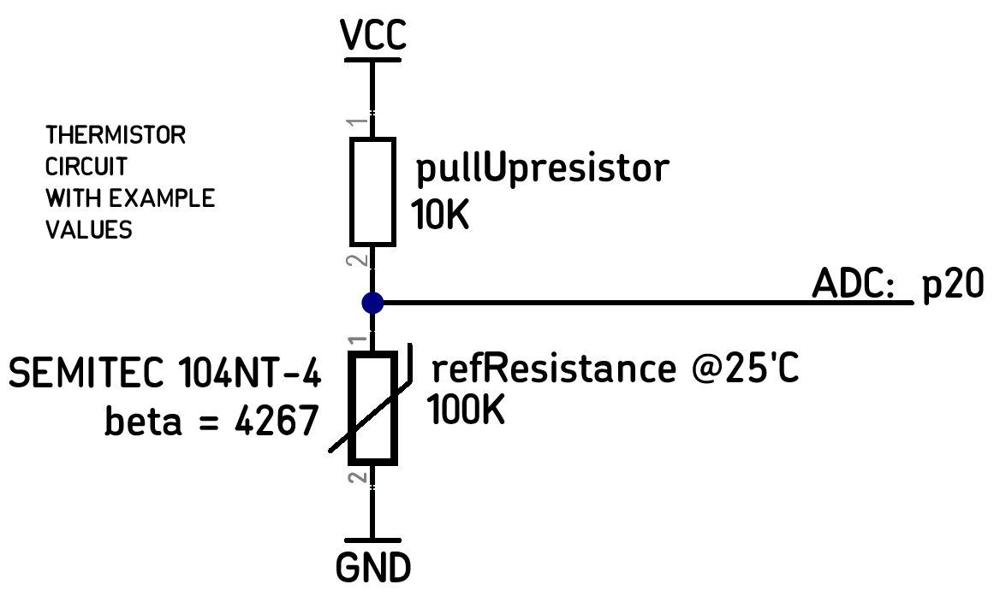
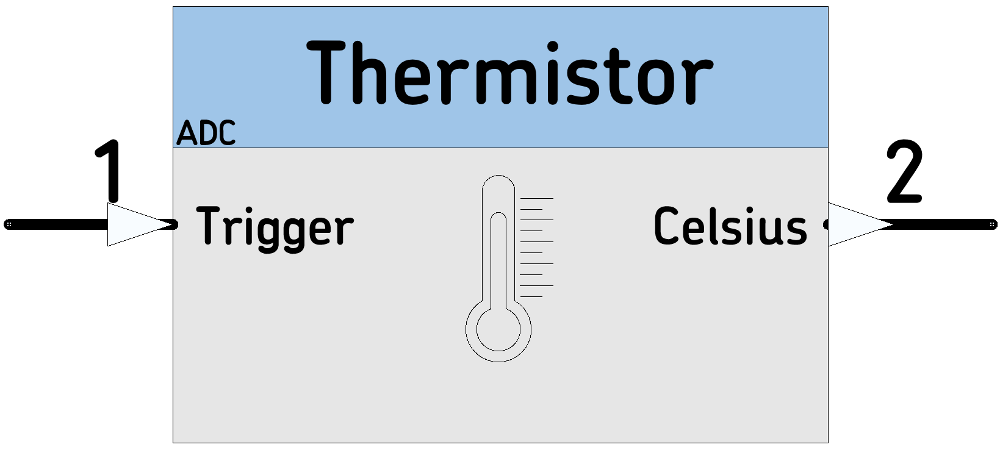

# [nblocks_thermistor](https://github.com/nBlocksStudioNodes/nblocks_thermistor)
This node handles temperature readings via ADC, from a grounded NTC Thermistor pulled up with a resistor to the Microcontroller Vcc.

----

 

----

 

----

 *  Category: Sensor
 *  HAL: mbed
 *  Tested: LPC1768
 *  Author: Fernando Cosentino

 ## Implementation details
 The Node is using the mbed AnalogIn class which returns a value ratiometric to the Vcc value, so it works correctly with any Voltage that supplies the Microcontroller. It is not affected if Vcc is for example 3.3V or 3.0V

## Inputs/Outputs
 *  (1) Trigger: Starts a measurement conversion
 *  (2) Celsius:  °C  Temperature in degrees Celsius

## Parameters
 *  PinName: ADC pin
 *  float: Pullup resistor value connected to 3.3V
 *  float: Thermistor Resistance at Reference temperature
 *  float: Thermistor reference temperature
 *  float: Thermistor beta value

## Example:

[Ticker]-->[Thermistor]-->[StringFormat]-->[StringSerial]
